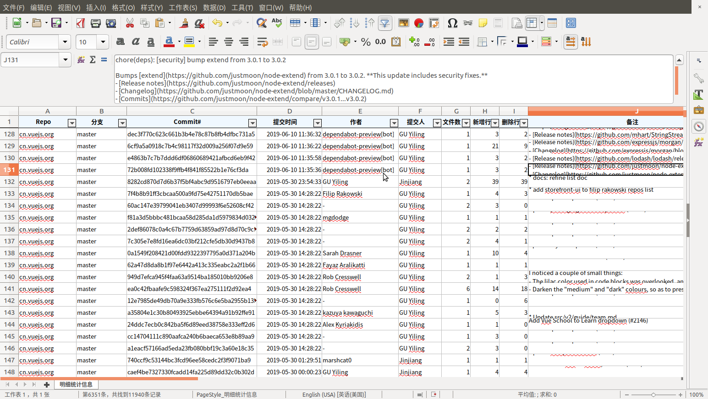
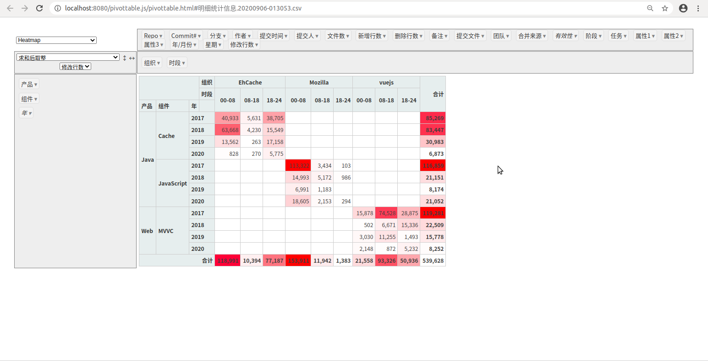
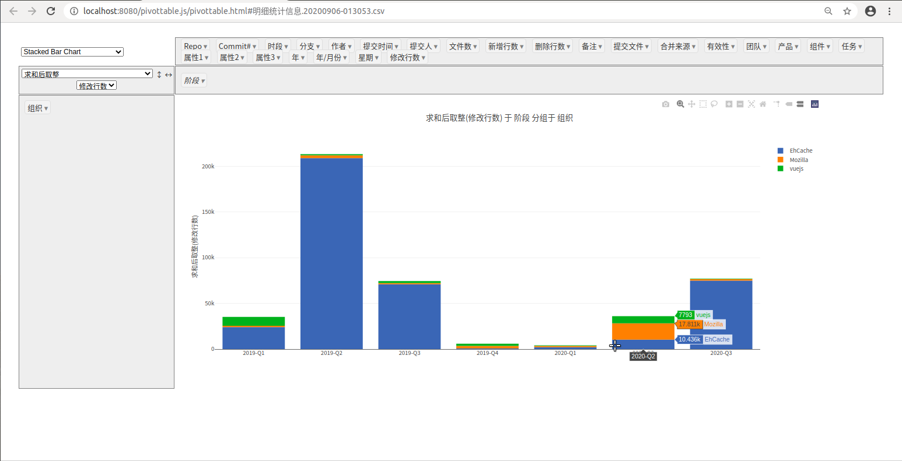

BizObj GitTools
=================

用于从 Git 本地仓库读取统计信息，产生 Excel 或者 CSV 格式文件的小工具

## 使用说明

- `Home` - 首页
  - `创建` - 运行分析工具，收集 Git 历史数据产生 Excel / CSV 文件;
  - `下载` - 下载最后一次执行创建所产生的文件;
  - `分析` - 使用自带的 [PivotTable.js](https://pivottable.js.org) 分析 Git 历史数据（只支持 CSV 方式创建的文件）;
- `Settings` - 设置
  - 用于设置运行参数。

## 扩展

系统包括多个扩展的统计字段（例如 组织、产品线、模块、任务号等），可以使用 Groovy 脚本进行扩展，具体参考 [git-tool-test-groovy/src/main/groovy/example.groovy](./git-tool-test-groovy/src/main/groovy/example.groovy) 文件.

## Screens

### Settings

### 导出的文件

透视表及图表

